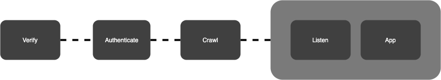
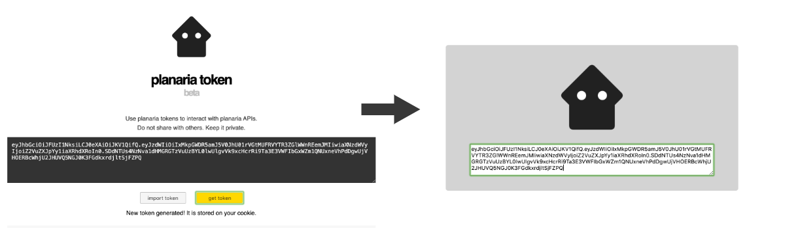
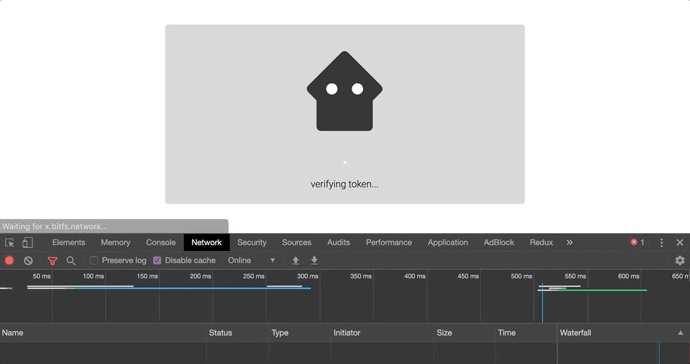
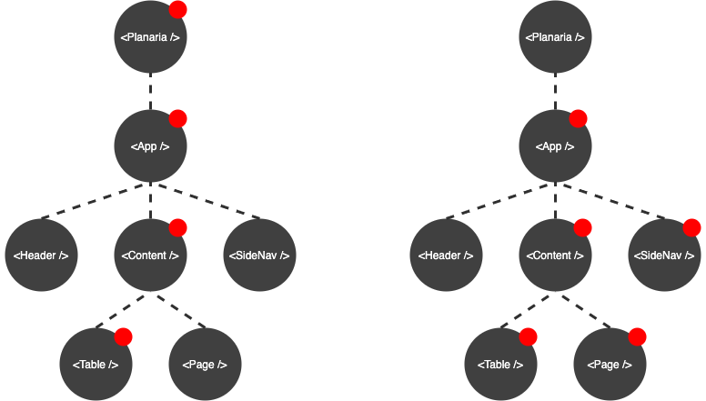

# react-planaria

> build serverless bitcoin apps in react.js

`@planaria/react-planaria` will allow you to easily build a serverless bitcoin web app in react utilzing the planaria toolchain.
___

# Why?

Building a bitcoin app used to be really complicated. You had to run a full bitcoin node, build a backend that scrapes the chain, create processes to clean and store data into a db, and construct an API to expose the application data.

The Bitbus service automates the first two steps of the process, but what if we take it a step farther and build a completelely serverless bitcoin web app.

ReactPlanaria will take you from 0 to a usable webapp in minutes. Allowing you to prototype faster and get user feedback all without going through the pains of building a full backend.

___

# Overview

 The library uses the `Bitbus` streaming API to crawl past transactions, `Bitsocket` SEE API for listening to real time events, and `BitFS` for fetching large files like images and videos.

 The boot sequence ensures authentication and crawling is complete before the app launches. Bitsocket listening occurs in the background and will continue to update the state of your application in real time.




___

## 0. authentication

API calls to Bitbus require a valid Planaria Token for authentication. If you have not logged in with your token already, the module will prompt for a key. Go to `https://token.planaria.network` and copy/paste your token to proceed. It will be stored as a cookie to automate future login authentications.



## 1. crawl

You can crawl using Bitbus to load up past transctions relevant to your app. If you pass `crawl: true` to the Planaria component, react-planaria will fetch the most recent transactions matching the query.The `limit: 30` attribute will cap your query so you do not acquire to much memory in your webapp. This example will fetch the most recent 30 videos from the `b://` protocol to create a movie player application.

```jsx
import { render } from 'react-dom'
import React from 'react'
import App from './App'
import Planaria from '@planaria/react-planaria'
const conf = {
  query: {
    q: {
      find: { 
        "out.s2": "19HxigV4QyBv3tHpQVcUEQyq1pzZVdoAut", 
        "$or": [ 
          { "out.s4": "video/mp4" }, 
          { "out.s4": "video/mp3" }, 
          { "out.s4": "video/ogg" }, 
          { "out.s4": "video/mpeg" },
        ], 
      },
      sort: { "blk.i": -1 },
    }
  },
  limit: 30,
  crawl: true,
}
render(
  <Planaria {...conf} app={App} />, 
  document.getElementById('entry')
)
```


During the crawling process, the application will enter a `crawling` state wheree a loading UI will pop up until the crawl stream is complete. Upon completion your `app={App}` component will boot with the crawled transactions inside of `this.props.txs`. Don't be afraid to pull in lots of transactions. Because of the seperation between Bitfs and Bitbus databases, the json being retrieved is quite small. You can easily pull in thousands of transactions a second into the browser. Observed ingestion rate is over 2MB per second.




___

## 2. listen

If your app needs any realtime updates, listen mode can be invoked to subscribe your query to the Bitsocket SSE endpoint. Your app can run while the SSE connection is handled in the background. When realtime transaction events are picked up, the state of the `<Planaria />` component is updated, causing your `<App />` to re-render with the new transactions available. You can toggle listening mode on/off by accessing `this.props.toggle()`. This will also allow/prevent your app from receiving state updates from the listening process. 

```jsx
import { render } from 'react-dom'
import React from 'react'
import App from './App'
import Planaria from '@planaria/react-planaria'
const conf = {
  query: {
    q: {
      find: { 
        "out.o1": "OP_RETURN"
      },
    }
  },
  listen: true
}
render(<Planaria {...conf} app={App} />, document.getElementById('entry'))
```


___

# Getting Started

## 0. install

```
$ npm i @planaria/react-planaria react react-dom -S
```

## 1. injection

Simply wrap the root of your react app `<App />` with the `<Planaria />`  component with a given query, and your app now has access to the transactions in its state. You can then use then use transactions in your application however you please.


```jsx
import { render } from 'react-dom'
import React from 'react'
import App from './App'
import App from '@planaria/react-planaria'
const conf = {
  query: {
    q: {
      find: { 
        "out.o1": "OP_RETURN",
      },
      sort: { "blk.i": -1 },
    },
  },
  limit: 30,
  crawl: true,
}
render(<Planaria {...conf} app={App} />, document.getElementById('entry'))
```


## 2. props
Updates from the `<Planaria />` component will automatically be forwarded to the `<App />` props. The app given to Bitbus now has access to the full list of transactions from crawling and listening located in the components `props.txs`. You can use those transactions and bitfs pointers to build a video explorer in 20 lines of code.


```jsx
import React, { Component } from 'react'
export default class App extends Component {
  constructor(props) {
    super(props)
  }
  render() {
    return(
      this.props.txs.flatMap((tx, i) => { 
        const videos = tx.out
          .filter(xput => Boolean(xput.f3) === true)
          .map(xput => xput.f3)
          .map(f3 => {
            return (
              <video width="100%" height="900" controls>
                <source src={`http://x.bitfs.network/${f3}`} />
              </video>
            ) 
          })
        return videos
      })
    )
  }
}
```

## 3. state

 Once the root of your app receives txs through props, you can choose to pass the txs array, or any filtered subsets down to children components which will then refresh when the Planaria component receives data. However, you can also manage state at the application layer entirely independently from the `<Planaria />` state wrapper. This means you can introduce react-router, redux, or any other state management tool you are used to.



___

# API

## 0. constructor

|     name   |    type     |                default               | description              |
|:-----------|:-----------:|:------------------------------------:|:-------------------------|
| app        |  Component  |     null                             | Root react component     |
| query      |   Object    |     {find:{"out.o1": "OP_RETURN"}}   | Bitquery query object    |
| crawl      |   Boolean   |     false                            | Do crawl?                |
| listen     |   Boolean   |     true                             | Do listen?               |
| limit      |   Number    |     1000                             | Max transactions crawled |


## 1. methods

|     name     |    params   |                returns                                | description                                    |
|:-------------|:-----------:|:-----------------------------------------------------:|:-----------------------------------------------|
| listen       |             | Object (success: Boolean, err: Object)                | Starts SEE connection to Bitsocket             |
| crawl        |             | Object (success: Boolean, total: Number, err: Object) | Starts crawling. Changes app to crawling state |
| verify       |             | Object (success: Boolean, err: Object)                | Verifies token against Planaria backend        |
| authenticate |             |                                                       | Prompts user for Planaria Token            |
| setLimit     |   Number    |                                                       | Updates max crawl transaction limit            |
| setQuery     |   Object    |                                                       | Updates Bitquery object                        |
| setToken     |   String    |                                                       | Updates user token. Start verification         |

___

# Examples

## 0. crawl example

- [Live demo](http://interplanaria.github.io/react-planaria-carwl-demo)
- [Code](https://github.com/interplanaria/react-planaria-crawl-demo)


## 1. listen example

- [Live demo](http://interplanaria.github.io/react-planaria-listen-demo)
- [Code](https://github.com/interplanaria/react-planaria-listen-demo)


## 2. b:// images

- [Live demo](http://interplanaria.github.io/react-planaria-b-img)
- [Code](https://github.com/interplanaria/react-planaria-b-img)


## 3. b:// videos

- [Live demo](http://interplanaria.github.io/react-planaria-b-video)
- [Code](https://github.com/interplanaria/react-planaria-b-video)


___
